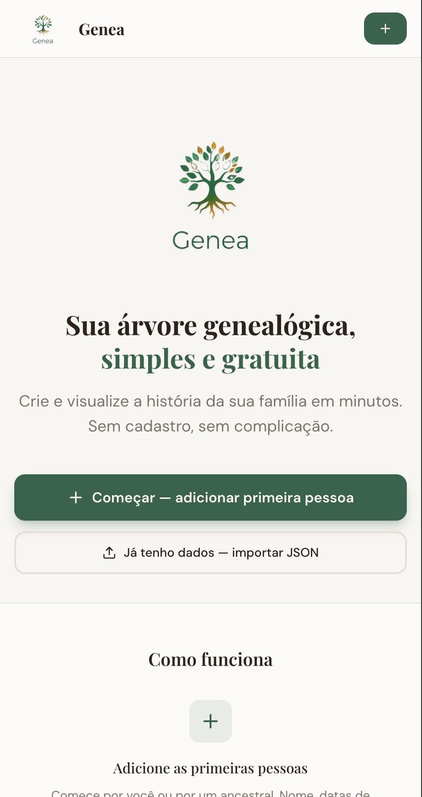
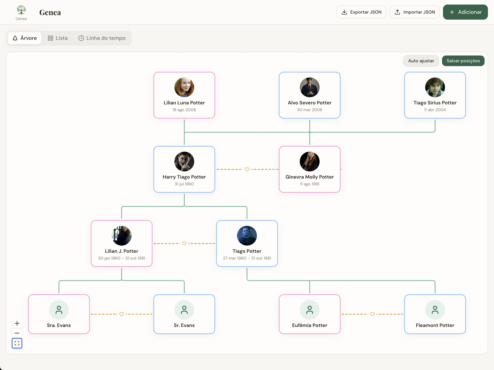
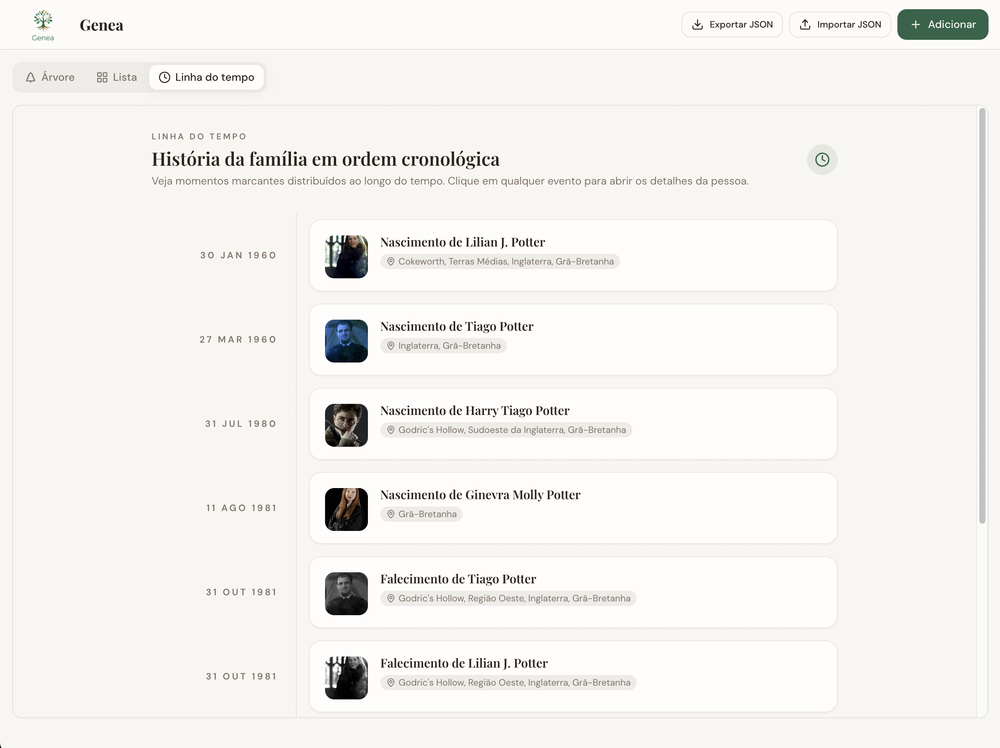
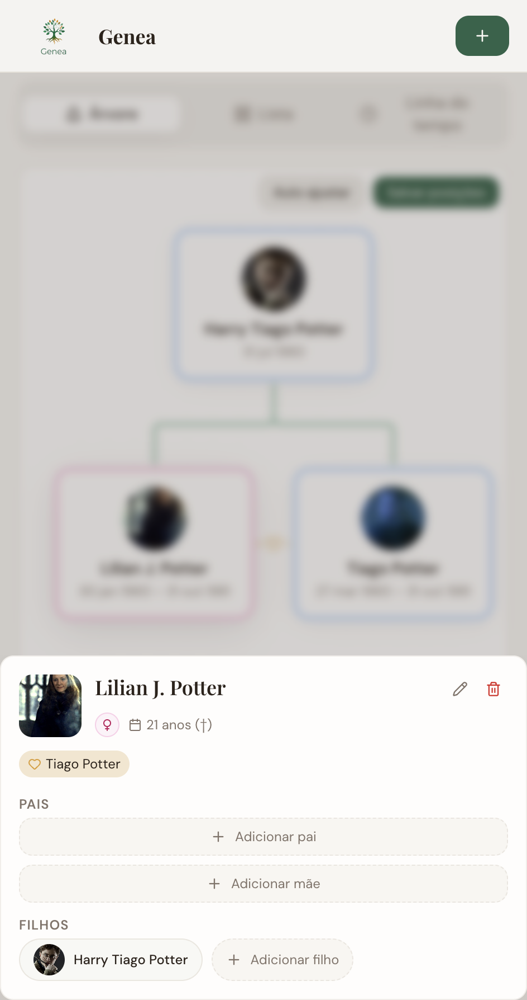
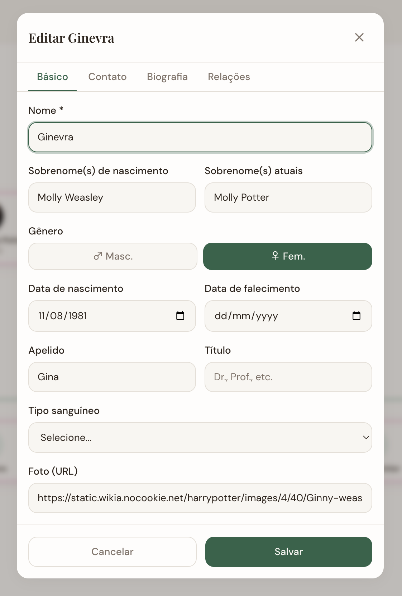

# Genea

Sua árvore genealógica, simples e gratuita. Crie e visualize a história da sua família em minutos — sem cadastro, sem complicação.

**Live**: [arvore-genea.vercel.app](https://arvore-genea.vercel.app)

---

## Galeria

### Landing page
Boas-vindas quando a árvore está vazia — explica o que é o Genea e orienta a começar.



### Árvore genealógica
Visualização em árvore com pais, filhos e cônjuges conectados.



### Linha do tempo
Eventos (nascimentos e falecimentos) ordenados cronologicamente.



### Detalhes e relações
Card expandido para adicionar pais, filhos e cônjuge a uma pessoa.



### Formulário de edição
Dados básicos, contato, biografia e relações em abas.



---

## Recursos

- **Árvore visual** — Veja sua família em formato de árvore, com layout automático
- **Linha do tempo** — Ordene os membros por período de vida
- **Lista** — Visualize todos os membros em cards
- **Importar / exportar JSON** — Guarde os dados onde quiser e evite vendor lock-in
- **Privacidade** — Tudo é processado no seu navegador; os dados ficam apenas no seu dispositivo
- **PWA-ready** — Use no celular ou no computador; alterações são salvas automaticamente

## Como rodar

```sh
npm install
npm run dev
```

A aplicação abre em `http://localhost:8080`.

## Deploy

O build estático pode ser servido em qualquer host (Vercel, Netlify, etc.):

```sh
npm run build
```

Os arquivos ficam em `dist/`.

## Tecnologias

- Vite, React, TypeScript
- Tailwind CSS, shadcn/ui
- React Flow (árvore), Recharts (gráficos)
- Framer Motion (animações)
